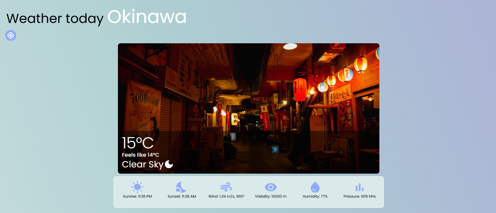
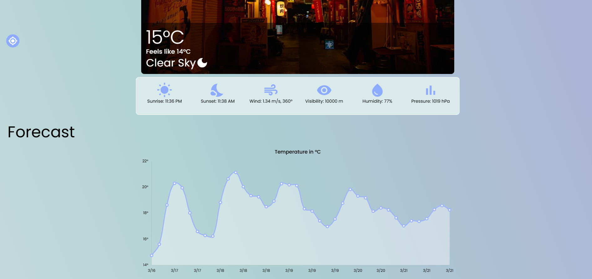

# Weather app (weather-app)

Weather tracking app

## Install the dependencies

```bash
yarn
# or
npm install
```

### Add .env.local file and add enviroment variables here

```bash
VITE_API_KEY=""
VITE_API_URL=""
VITE_PEXELS_API_KEY=""
VITE_PEXELS_API_URL=""
```

### Start the app in development mode (hot-code reloading, error reporting, etc.)

```bash
quasar dev
```
### Build the app for production

```bash
quasar build
```

### Customize the configuration

See [Configuring quasar.config.js](https://v2.quasar.dev/quasar-cli-vite/quasar-config-js).

### Preview



